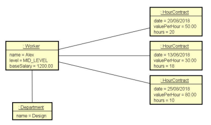

# About the project

This project was made to practice composition and design.

### Model
- Read data from Worker with N (output from user) contracts.  
- Request a user a month and the correspondent salary.


### This is how objects are instantiated in memory


### Outcome


### Technologies
Java

### How to install this code?

```
git clone git@github.com:AleehSophia/JavaBasics.git
```

You'll need to have an IDE that supports Java, and run the code.